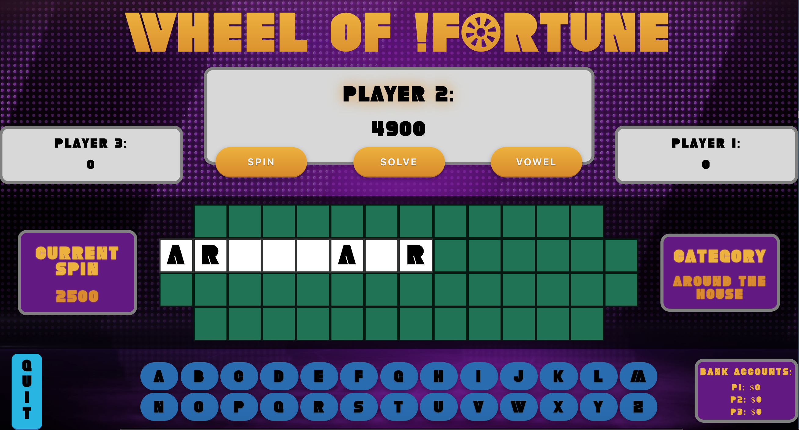
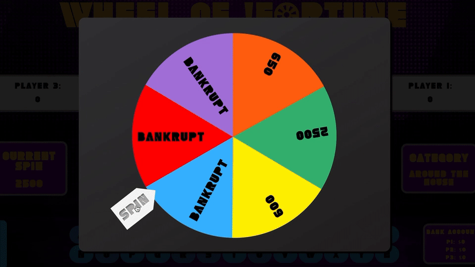
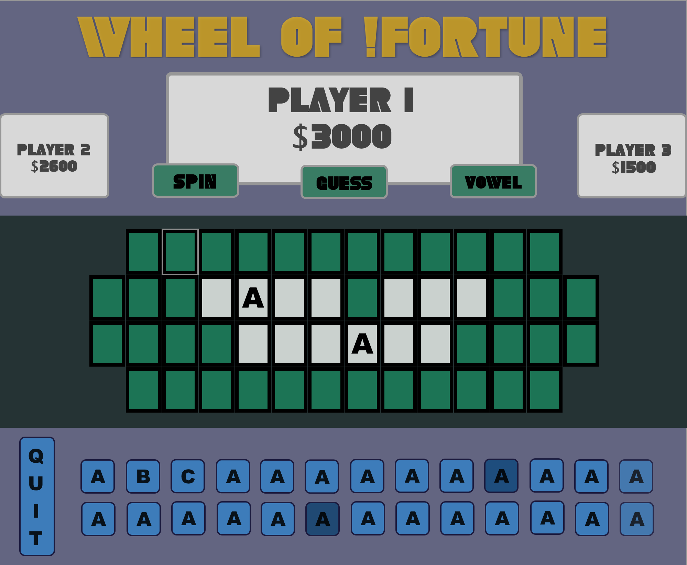

# Wheel of !Fortune

This project is a web-based Wheel of Fortune game designed for three players where players try to guess letters in a randomly generated puzzle while spinning a wheel to determine the point value for each letter. There are four rounds and an additional bonus round for the player with the highest score after the first four rounds. The main objective of this project was to design a game implementing OOP patterns with classes and methods following SRP. Additionally we wanted to create an intuitive and engaging UI/UX.

## To View Live:

Either visit [this page](https://b3an5.github.io/wheel-of-fortune/) to see the live site

### or

Run `git clone https://github.com/b3an5/wheel-of-fortune.git` in your terminal to copy locally

## To collaborate:

clone down the repository `cd` into the directory and run `npm install`

### Original Wireframe

#### And some button inspiration [here](https://dribbble.com/shots/4658149-Turn-me-on)

### Authors

- Theo Bean
  - https://github.com/b3an5
- Jamie Rushford
  - https://github.com/jarushford
- Link to [pair DTR](https://gist.github.com/jarushford/fa3d748f09c5e7d82bd9ec605d16f533)
- Link to [original project spec](http://frontend.turing.io/projects/wheel-of-fortune.html)
